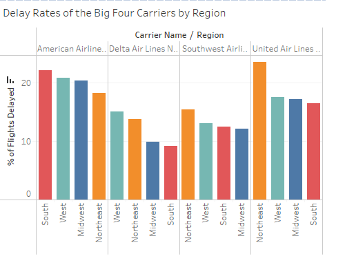
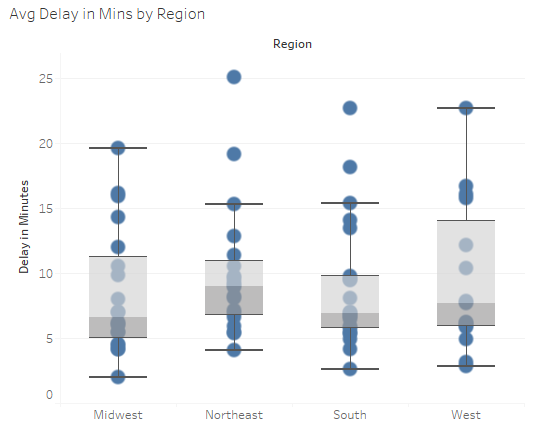

# Analyzing Airline Delays
 **Tools:** Tableau & R

**Dashboard:** [Tableau Dashboard](https://public.tableau.com/app/profile/ashish.mathew5550/viz/AirlineDelays_17404230060070/Dashboard1)
 
 **Data:** [Bureau of Transportation Statistics (BTS)](https://www.transtats.bts.gov/ot_delay/ot_delaycause1.asp)
 
 **Reference:** [Hex-Maps in Tableau](https://www.tableau.com/blog/viz-whiz-hex-tile-maps-64713)

 **Objective:** Analyze airline arrival statistics by state/region, carrier (Delta, SouthWest, etc.) to determine regions with poor airline service

*Note: An airline is reported as a late arrival if the actual arrival time is more than 15 minutes after its scheduled arrival time*

 **Findings:**
 - New Jersey had a 27% arrival delay rate in November 2024, nearly twice the national average (14%). Regarding the cause for delays, 63% were due to the National Air System (NAS). This was driven by [FAA staffing shortages at Newark](https://www.reuters.com/business/aerospace-defense/united-says-faa-staffing-shortages-causing-significant-disruption-newark-hub-2024-11-26/)
 - Delta outperformed the other big carriers (American Airlines, SouthWest and United) with a 11% delay rate. Delata outperformed its competitors across regions
 - While the northeast region had a higher median delay (in minutes), it had the lowest variability in delay times

   

   

   **Next Steps:** Create a month-over-month view using past data to determine seasonality and forecast delay times. 
 
